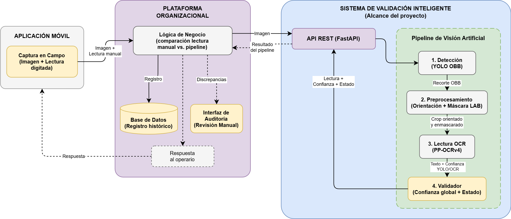
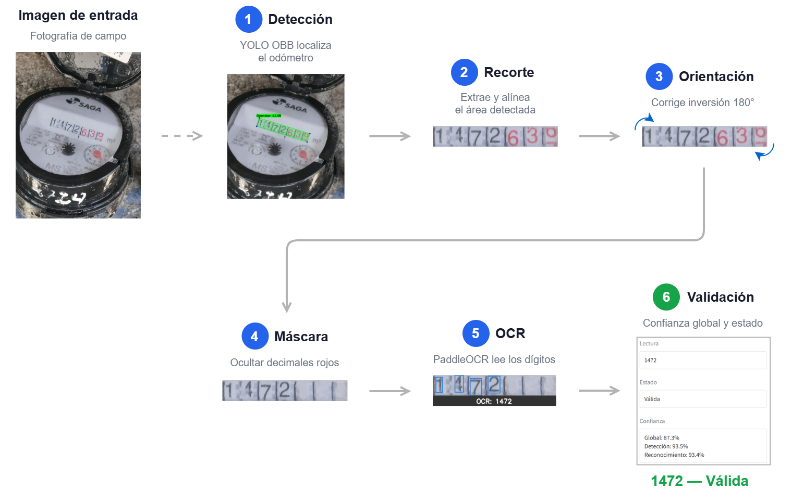
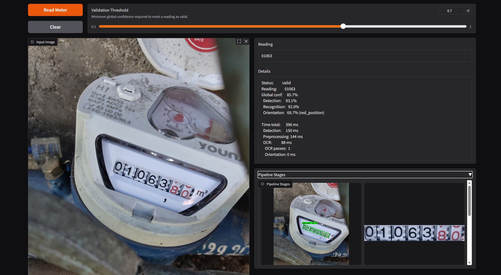
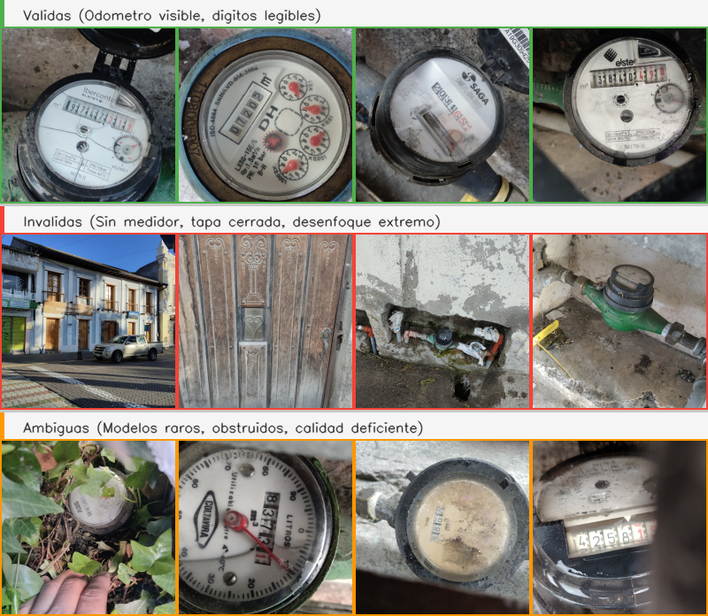

# Lectura Automática de Medidores de Agua

Este repositorio contiene el código, modelos, datos y documentación del pipeline de Machine Learning implementado para apoyar a la validación automática de lecturas en medidores de agua, desarrollado para la empresa SOLYTEC. Combina detección de odómetros (YOLO OBB), preprocesamiento de imagen y lectura de dígitos (PaddleOCR fine-tuned) con un esquema de validación human-in-the-loop.

## Descripción del Problema

SOLYTEC es una empresa ecuatoriana de tecnología especializada en servicios de gestión de medidores de agua, con más de 20 años de operaciones. La empresa gestiona ciclos de lectura para la facturación mensual de empresas de agua potable.

**Proceso actual:** Los operarios capturan fotografías de los medidores en campo y registran manualmente el valor de consumo. El sistema actual solo aplica una validación lógica básica (lectura >= lectura anterior), sin verificación sistemática entre la foto capturada y el valor digitado.

**Problemas identificados:**
- Tasas de error del 3-5% en lecturas digitadas
- Imágenes inválidas (borrosas, mal encuadradas, sin medidor) que rompen la trazabilidad
- Auditoría reactiva: la revisión manual solo cubre muestreos aleatorios del 3-5% del volumen mensual
- Sin indicador de confianza ni coincidencia automática foto-lectura

**Causas raíz:** El análisis de causa raíz (Ishikawa) identificó factores en cinco categorías: proceso manual sin verificación automática, validación tecnológica insuficiente, condiciones ambientales no controladas (iluminación, suciedad, acceso difícil), variabilidad entre operarios, y cobertura limitada de auditoría.

**Objetivo del proyecto:** Desarrollar un sistema para la validación automática de lecturas de medidores de agua potable, basado en visión por computador y aprendizaje profundo, que analice la evidencia fotográfica, extraiga el valor marcado y genere indicadores de confianza para apoyar el aseguramiento de calidad del proceso de toma de lecturas.

## Arquitectura del Pipeline



El pipeline opera en seis etapas secuenciales:

1. **Detección**: Localiza el odómetro en la imagen usando YOLO con Oriented Bounding Boxes (OBB), que permite detectar objetos rotados con mayor precisión que bounding boxes alineados a ejes.

2. **Recorte**: Extrae el área del odómetro aplicando rotación y alineación basadas en las coordenadas OBB, produciendo un crop rectangular del display de dígitos.

3. **Resolución de orientación**: Determina si el crop está invertido 180 grados mediante una cascada de tres etapas: (a) asegurar formato landscape, (b) cue de posición de dígitos rojos decimales, (c) fallback dual-OCR que ejecuta el reconocedor en ambas orientaciones y selecciona la de mayor score.

4. **Máscara decimal**: Enmascara los dígitos rojos decimales del odómetro mediante segmentación en espacio de color LAB (canal a* relativo) con compuerta HSV, seguida de inpainting TELEA. Esto evita que el OCR lea dígitos decimales que no forman parte de la lectura de consumo.

5. **OCR**: Lee los dígitos con PaddleOCR (PP-OCRv4 mobile) fine-tuned con diccionario restringido a dígitos (0-9), operando en modo rec-only (bypass del detector de texto interno).

6. **Validación**: Calcula la confianza global como `det_conf x rec_conf` y clasifica la lectura como `valid` (confianza >= 0.7), `needs_review` (confianza < 0.7) o `no_detection` (sin odómetro detectado).



## Estructura del Proyecto

```
water-meter-capstone/
├── app/                         # Aplicación (demo + API)
│   ├── pipeline.py              # Pipeline de inferencia principal
│   ├── api.py                   # REST API (FastAPI)
│   └── demo.py                  # Demo interactivo (Gradio)
├── utils/                       # Módulos de utilidad
│   ├── cropping.py              # Recorte OBB
│   ├── orientation.py           # Resolución de orientación
│   ├── masking.py               # Máscara de dígitos rojos
│   └── logging.py               # Configuración de logging
├── scripts/
│   ├── data/                    # Pipeline de datos (00-03 + builders)
│   └── eval/                    # Scripts de evaluación
├── notebooks/                   # Notebooks de entrenamiento y análisis
├── models/                      # Modelos entrenados
│   ├── odometer-detector/       # YOLO OBB (producción)
│   ├── ocr-reader/              # PaddleOCR fine-tuned (producción)
│   └── auto-annotator/          # Modelo auxiliar de pre-anotación
├── data/                        # Datasets de entrenamiento
│   ├── annotations/             # Anotaciones CVAT + artefactos
│   ├── obb/                     # Dataset YOLO OBB (train/val/test)
│   └── ocr/                     # Dataset OCR (train/val/test)
├── results/                     # Resultados pre-computados de evaluaciones
├── docs/                        # Informes y documentación técnica
└── samples/                     # Imágenes de ejemplo para pruebas
```

## Requisitos Técnicos

- Python 3.12
- ~800 MB de espacio en disco (modelos + datos)
- CPU suficiente para inferencia (GPU opcional)

### Dependencias principales

| Componente | Versión | Uso |
|------------|---------|-----|
| PyTorch | ≥ 2.10 | Backend de YOLO |
| Ultralytics | ≥ 8.0 | Detección OBB (YOLOv8) |
| PaddlePaddle | ≥ 3.0 | Backend de OCR |
| PaddleOCR | ≥ 3.0 | Reconocimiento de dígitos |
| OpenCV | ≥ 4.10 | Procesamiento de imagen |
| Gradio | ≥ 6.0 | Demo interactivo |
| FastAPI | ≥ 0.115 | API REST |
| scikit-learn | ≥ 1.0 | Estratificación de datos |

`requirements.in` lista las dependencias directas del proyecto y `requirements.txt` incluye además las sub-dependencias con versiones exactas.

## Instrucciones de Ejecución

```bash
# 1. Clonar el repositorio
git clone <repo-url>
cd water-meter-capstone

# 2. Crear entorno virtual
python -m venv .venv
.venv\Scripts\activate        # Windows
# source .venv/bin/activate   # Linux/Mac

# 3. Instalar dependencias
pip install -r requirements.txt

# 4. Ejecutar demo interactivo
python app/demo.py
# Abrir http://localhost:7860 en el navegador

# 5. Ejecutar API REST (alternativa)
python -m app.api
# Documentación en http://localhost:8000/docs
```

Las imágenes de prueba para la ejecución rápida se pueden encontrar en `samples/` y los casos inválidos en `samples/invalid/`.

La demo presenta la interfaz completa del pipeline con campos individuales para lectura, estado, confianza (global, detección y reconocimiento) y tiempo de procesamiento. La galería inferior derecha muestra las cuatro etapas de forma visual: detección, recorte, reorientación y enmascaramiento de decimales. También se incluye un panel desplegable que permite visualizar la respuesta JSON devuelta por el pipeline.



**Video demostrativo:** https://youtu.be/PEs_WnlbImI

## Uso Programático

```python
import cv2
from app.pipeline import WaterMeterPipeline

pipeline = WaterMeterPipeline()
image = cv2.imread("samples/00004.jpg")
result = pipeline.predict(image)

print(f"Lectura: {result.reading}")
print(f"Confianza: {result.global_confidence:.2f}")
print(f"Estado: {result.status}")
```

## Datos

### Dataset Original

El proyecto partió de ~3,200 imágenes operativas proporcionadas por SOLYTEC, capturadas en campo por lectores de medidores. Las imágenes fueron clasificadas manualmente en tres categorías:

| Clase | Cantidad | Descripción |
|-------|----------|-------------|
| Válida | 1,199 | Odómetro visible y dígitos legibles |
| Inválida | ~1,200 | Sin medidor, tapa cerrada, desenfoque extremo |
| Ambigua | ~800 | Modelos raros, obstrucciones parciales, calidad deficiente |



### Proceso de Anotación

Las 1,199 imágenes válidas fueron anotadas en CVAT en dos capas:
- **OBB**: Oriented Bounding Boxes delimitando el área del odómetro
- **Transcripciones OCR**: Lectura de dígitos como ground truth

Para acelerar la anotación OBB, se entrenó un modelo auxiliar (auto-annotator) con ~300 imágenes etiquetadas manualmente, que generó pre-anotaciones revisadas y corregidas por humanos.

### Partición Estratificada

El dataset final de 1,199 imágenes se particionó en hold-out estratificado 80/10/10:

| Split | Cantidad |
|-------|----------|
| Train | 959 |
| Validación | 120 |
| Test | 120 |

Variables de estratificación: color de fondo (blanco/negro), número de dígitos enteros (4 o 5) y presencia de decimales (sí/no).

### Datos en este Repositorio

- `data/annotations/` - Imágenes fuente, labels OBB y crops OCR
- `data/obb/` - Dataset YOLO OBB listo para entrenamiento (train/val/test)
- `data/ocr/` - Dataset OCR para fine-tuning (train/val/test)
- `samples/` - Imágenes de ejemplo para pruebas del demo

### Acceso, Anonimización y Uso

- El dataset operativo original fue provisto por SOLYTEC exclusivamente para fines del proyecto.
- El repositorio incluye únicamente los artefactos necesarios para entrenamiento, evaluación y demostración académica.
- El acceso a datos operativos adicionales queda restringido a la organización.
- Los resultados compartidos en `results/` y `docs/` se presentan como evidencia técnica del prototipo y del proceso de validación realizado.

## Modelos

### Detector de Odómetro (YOLO OBB)

- **Arquitectura**: YOLOv8n-OBB (3.2M parámetros)
- **Entrenamiento**: 100 epochs, 640px, batch 16, Tesla T4 (Google Colab)
- **Dataset**: 1,199 imágenes con OBB anotados, split 80/10/10
- **Tarea**: Detección de una sola clase (odómetro) con bounding box orientado

| Métrica | Val | Test |
|---------|-----|------|
| mAP50-95 | 0.961 | 0.952 |
| mAP50 | 0.995 | 0.995 |
| Precision | 0.999 | 0.992 |
| Recall | 1.000 | 1.000 |

### Lector OCR (PaddleOCR fine-tuned)

- **Arquitectura**: PP-OCRv4 mobile (SVTR_LCNet backbone, MultiHead CTC+NRTR)
- **Fine-tuning**: 20 epochs, lr=1e-4, batch 8, diccionario digit-only (0-9)
- **Modo**: rec-only (bypass del detector de texto interno)
- **Preprocesamiento**: Máscara LAB refinada para dígitos decimales rojos

| Métrica | Val | Test |
|---------|-----|------|
| Exact Match | 89.17% | **92.50%** |
| CER | 0.026 | 0.019 |
| EM con decimales | 89.29% | 94.05% |
| EM sin decimales | 88.89% | 88.89% |

### Auto-anotador (auxiliar)

- **Arquitectura**: YOLOv8s-OBB, entrenado con ~300 imágenes semilla
- **Propósito**: Generar pre-anotaciones OBB para acelerar el etiquetado manual en CVAT
- **mAP50**: 0.893

Ver `models/README.md` para detalles adicionales.

## Evidencia de Mejoras

### Detector YOLO OBB

Se realizaron 5 iteraciones explorando resolución, arquitectura, augmentation y convergencia. El baseline resultó ser la mejor configuración:

| Iteración | Cambio | mAP50-95 (val) | Resultado |
|-----------|--------|---------------:|-----------|
| Baseline | YOLOv8n, 640px, 100 ep | 0.961 | Adoptado |
| Iter 1 | 640 -> 1280px | 0.956 | Revertido |
| Iter 2 | YOLOv8n -> YOLOv8s | 0.957 | Revertido |
| Iter 3 | YOLO11n | 0.962 | Revertido (bajo umbral) |
| Iter 4 | copy_paste augmentation | 0.952 | Revertido |
| Iter 5 | 200 epochs | 0.957 | Revertido |

Con una sola clase y objetos de tamaño uniforme, la configuración mínima ya captura toda la variabilidad del dataset.

### Lector OCR

La mejora fue sustancial, desde un OCR pre-entrenado sin ajustar hasta un modelo fine-tuned con máscara decimal:

| Iteración | Configuración | EM |
|-----------|--------------|------:|
| Baseline | Configuración de fábrica (det+rec) | 4.17% (val) |
| Iter 1 | Bypass del detector de texto (rec-only) | 15.83% (val) |
| Iter 3 | PP-OCRv4 english-only, vocabulario reducido | 30.00% (val) |
| Iter 4 | Fine-tuning con diccionario digit-only, 20 ep | 90.00% (val) / 87.50% (test) |
| Iter 6 | Máscara LAB refinada + re-entrenamiento | 89.17% (val) / **92.50% (test)** |

Los cambios de mayor impacto fueron: bypass del detector de texto (+11.7 pp), cambio a PP-OCRv4 english-only (+14.2 pp), fine-tuning con diccionario de dígitos (+60 pp) y refinamiento de la máscara LAB (+5 pp en test).

El registro completo de todos los experimentos se encuentra en `docs/Detalle de Resultados.md`.

## Resultados de Evaluación

### Pipeline Completo (end-to-end, test set)

Evaluado sobre 120 imágenes del split de test con threshold de validación 0.7:

| Métrica | Valor |
|---------|-------|
| End-to-end accuracy | **95.83%** (115/120) |
| Strict match rate | 94.17% |
| Readable rate | 100.00% |
| Auto-validation rate | 93.33% |
| Precisión de auto-validación | 96.43% |
| Latencia P95 | 596 ms |

**Rendimiento por subgrupo:**

| Subgrupo | Match rate |
|----------|-----------|
| Con decimales (n=84) | 97.62% |
| Sin decimales (n=36) | 91.67% |
| 4 dígitos (n=63) | 93.65% |
| 5 dígitos (n=57) | 98.25% |

### Validación Piloto (datos de campo no vistos)

Evaluado sobre 300 imágenes operativas reales, no utilizadas durante el desarrollo:

| Métrica | Valor |
|---------|-------|
| Pilot match rate | **82.67%** (248/300) |
| Readable rate | 92.67% |
| Match rate sobre procesables | 86.71% (248/286) |
| Auto-validation rate | 83.33% |
| No-detection rate | 6.67% |
| Latencia P95 | 1,509 ms |

**Causas raíz de los 32 errores de lectura en el piloto:**

| Causa | Cantidad | Descripción |
|-------|----------|-------------|
| Sesgo de posición | 14 | Omisión del último dígito |
| Calidad visual degradada | 7 | Suciedad, empañamiento, obstrucción |
| Orientación incorrecta | 4 | Inversión 180 grados |
| Imagen rotada/inclinada | 3 | Captura en posición incómoda |
| Error del operario | 2 | Imagen sin medidor o lectura inconsistente |
| Otros | 2 | Vegetación, off-by-one |

De las 20 imágenes sin detección, 14 no contenían un medidor con odómetro legible (no son errores del sistema). Los 6 fallos reales del detector se deben a condiciones adversas (suciedad, inclinación) o modelos de medidor no representados en el dataset de entrenamiento.

Los artefactos completos de evaluación (predicciones, fallos, barridas de threshold) se encuentran en `results/`.

### Análisis del Umbral de Validación

| Threshold | Test Auto-val | Test Precisión | Pilot Auto-val | Pilot Precisión |
|-----------|--------------|---------------|----------------|----------------|
| 0.60 | 100.00% | 95.83% | 89.67% | 89.96% |
| **0.70** | **93.33%** | **96.43%** | **83.33%** | **90.40%** |
| 0.75 | 85.00% | 98.04% | 70.33% | 91.47% |
| 0.80 | 60.00% | 100.00% | 53.33% | 90.62% |

El umbral de 0.70 ofrece el mejor balance para despliegue operativo con revisión humana.

## Explicabilidad

Se realizaron análisis de explicabilidad para comprender el comportamiento interno de los modelos (notebook `06_explainability.ipynb`).

### Detector YOLO (Eigen-CAM)

El análisis de Eigen-CAM confirma que el detector enfoca su atención dentro de la región del odómetro, con un ratio de foco de 1.04 (más atención dentro que fuera del OBB). La correlación de oclusión es positiva en la mayoría de los casos (0.58-0.69), lo que indica que el modelo depende de las características visuales del odómetro para la detección.

### OCR (Grad-CAM)

El análisis de Grad-CAM reveló un hallazgo clave: **sesgo de posición**. El modelo exhibe una reducción sistemática de activación en las posiciones finales de los dígitos. La causa es que el 70% del dataset de entrenamiento tiene decimales enmascarados, dejando las posiciones finales vacías. El modelo aprendió este patrón general de omitir las últimas posiciones.

**Impacto:** Este sesgo explica el error dominante del pipeline: el 66.7% de los errores en test y el 43.8% en el piloto son de tipo `missing_digits` (omisión del último dígito), afectando desproporcionadamente al subgrupo minoritario de medidores sin decimales.

**Recomendación prioritaria:** Aumentar la proporción de imágenes sin decimales en el dataset de entrenamiento para corregir el desbalance.

## Consideraciones Éticas y Limitaciones

### Enfoque Human-in-the-Loop

El sistema está diseñado como asistente de auditoría, no como reemplazo del criterio humano. Toda lectura con confianza inferior al threshold se envía a revisión manual, y se mantiene trazabilidad completa (imagen original, crop procesado, predicción, confianza).

### Limitaciones Conocidas

1. **Sesgo de posición en OCR**: El modelo deprioritiza las posiciones finales de los dígitos debido a la composición del dataset (70% con decimales enmascarados).
2. **Brecha controlado/operativo**: 13 pp de diferencia entre test (95.83%) y piloto (82.67%), atribuible a condiciones de campo no representadas en el entrenamiento.
3. **Confianza no calibrada**: La precisión de auto-validación se mantiene ~90% en el piloto independientemente del threshold (0.60-0.80), lo que indica que el score de confianza no discrimina bien entre lecturas correctas e incorrectas en datos operativos.
4. **Casos difíciles**: Lecturas de 5 dígitos (63.16% en piloto), medidores sucios/empañados y modelos de medidor no representados en el entrenamiento.

### Riesgos y Mitigaciones

| Riesgo | Mitigación |
|--------|-----------|
| Sesgo de representación en dataset | Documentación explícita de limitaciones, plan de expansión |
| Auto-validación incorrecta (9.6% en piloto) | Revisión humana obligatoria, threshold conservador |
| Condiciones de campo no controladas | Análisis de fallos por subgrupo, priorización de mejoras |
| Anonimización de datos | Datos provistos por la organización con consentimiento |

## Notebooks

| Notebook | Descripción |
|----------|-------------|
| `01_eda.ipynb` | Análisis exploratorio de datos |
| `02_train_auto_annotator.ipynb` | Entrenamiento del modelo auxiliar de pre-anotación |
| `03_train_odometer_detector.ipynb` | Entrenamiento del detector YOLO OBB (iterativo) |
| `04_eval_ocr.ipynb` | Evaluación de modelos OCR |
| `05_finetune_ocr.ipynb` | Fine-tuning del reconocedor OCR |
| `06_explainability.ipynb` | Análisis de explicabilidad (Grad-CAM, SHAP, LIME) |
| `07_visualize_pipeline_evaluations.ipynb` | Visualización comparativa de resultados |

## Pipeline de Datos

| Script | Descripción |
|--------|-------------|
| `00_clean_raw_data.py` | Consolida lotes, normaliza JPEG |
| `01_organize_classification.py` | Organiza imágenes por clase (valid/invalid/ambiguous) |
| `02_crop_odometers.py` | Recorta odómetros usando labels OBB |
| `03_generate_metadata.py` | Genera metadata con splits estratificados |
| `build_obb.py` | Construye dataset YOLO OBB con splits |
| `build_ocr.py` | Construye dataset OCR con rotación y máscara decimal |

## Documentación

- `docs/Informe Proyecto Capstone.pdf` - Informe final del proyecto capstone (incluye detalles sobre la ejecución del proyecto y anexos)
- `docs/Detalle de Resultados.md` - Registro completo de todos los experimentos y métricas
- `results/` - Artefactos de evaluación pre-computados (predicciones, fallos, barridas de threshold)

## Licencias y Atribuciones

Este proyecto utiliza modelos, frameworks, herramientas y recursos de terceros. A continuación se indican los principales componentes externos empleados durante el desarrollo del prototipo, junto con su tipo de licencia o condición de uso.

| Recurso | Tipo | Licencia / condición de uso |
|---------|------|-----------------------------|
| YOLOv8 (Ultralytics) | Modelo base para detección OBB | AGPL-3.0 |
| PaddleOCR / PP-OCRv4 | Modelo preentrenado para reconocimiento OCR | Apache 2.0 |
| PaddlePaddle | Framework de entrenamiento e inferencia OCR | Apache 2.0 |
| PyTorch | Framework de deep learning | BSD-3-Clause |
| Gradio | Interfaz de demostración | Apache 2.0 |
| FastAPI | Framework para la API web | MIT |
| CVAT | Herramienta de anotación de imágenes | MIT |
| Google Colab Pro | Entorno de entrenamiento con GPU | Servicio de pago sujeto a sus propios términos |
| Dataset de imágenes de medidores | Datos operativos utilizados para entrenamiento y evaluación | Propiedad de SOLYTEC, utilizados con autorización para fines del proyecto (no se redistribuyen públicamente) |

Los derechos y licencias de cada recurso externo pertenecen a sus respectivos autores y organizaciones. El código, modelos derivados, documentación y artefactos de este repositorio se presentan únicamente con fines académicos y de evaluación del proyecto de titulación.

## Autores

- Jorge Andrés Padilla Salgado
- Alain Mateo Ruales Quezada
